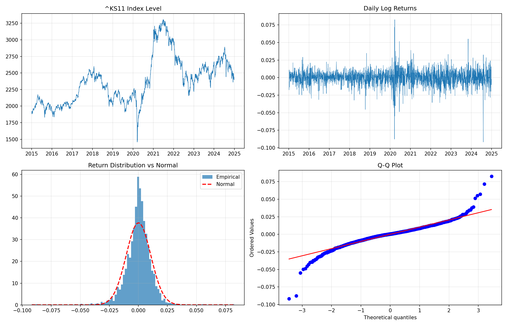

# KOSPI-VaR-Backtesting-Project
  by JAEMIN KO

KOSPI 지수를 대상으로 세 가지 VaR 모형을 구현하고, 통계적 검정을 통해
모형의 예측력을 검증하는 프로젝트.

## 진행 상황
- [x]  1.데이터 수집 및 수익률 분포 분석
- [ ]  2.Historical / Parametric / Monte Carlo VaR 구현
- [ ]  3.Kupiec POF, Christoffersen, 바젤 트래픽라이트 검정
- [ ]  4.위기구간 분석 및 Expected Shortfall

## 01
## 수익률 분포 분석 결과

분석 대상: KOSPI 종합지수 (^KS11), 2019-01-03 ~ 2026-07-30, 1,857 관측치

| 항목 | 값 |
|---|---|
| 연율화 수익률 | 13.89% |
| 연율화 변동성 | 25.45% |
| 왜도 | -0.89 |
| 초과첨도 | 10.72 |
| Jarque-Bera 통계량 | 9,086.58 (p < 0.001) |

정규성 가설은 1% 유의수준에서 기각되었다. 초과첨도 10.72는 정규분포
대비 꼬리가 극단적으로 두꺼움을 의미하며, 왜도 -0.89는 손실 방향의
꼬리가 이익 방향보다 길다는 것을 나타낸다.

관측 기간 중 최대 하락일인 2026-03-04(로그수익률 -12.85%)는 정규분포
가정 하에서 -8.05σ에 해당하며, 이는 발생확률 4.1×10⁻¹⁶으로 약 9.6조 년에
한 번 관측될 사건에 해당한다. 정규분포를 가정한 Parametric VaR이 극단적
손실을 심각하게 과소평가할 수 있음을 시사한다.

주목할 점은 최대 하락일과 최대 상승일(2026-03-05, +9.19%)이 연속된
거래일이라는 것이다. 이는 극단적 수익률이 무작위로 분산되지 않고 특정
국면에 집중되는 변동성 군집 현상을 보여주며, VaR 위반의 독립성을 검정하는
Christoffersen 검정이 필요한 근거가 된다.

### 표본 기간 선택의 영향

| 표본 기간 | 관측치 | 연율화 변동성 | 왜도 | 초과첨도 |
|---|---|---|---|---|
| 2015-01 ~ 2024-12 | 2,453 | 16.80% | -0.44 | 8.42 |
| 2019-01 ~ 2026-07 | 1,857 | 25.45% | -0.89 | 10.72 |

동일 지수에 대해 표본 기간만 달리했을 때 연율화 변동성이 1.5배,
초과첨도가 27% 증가한다. 추정 기간의 선택이 리스크 측정 결과에 미치는
영향이 크다는 점을 보여주며, 본 프로젝트가 단일 기간의 평균적 성능이
아닌 국면별 성능 진단에 초점을 맞추는 이유이기도 하다.



## 데이터

KRX 정보데이터시스템의 회원제 전환으로 pykrx 사용이 제한되어
Yahoo Finance API로 전환. 수정종가 기준 일별 데이터.

## 실행

```
pip install -r requirements.txt
python codes/01_log_return_distribution.py
```

