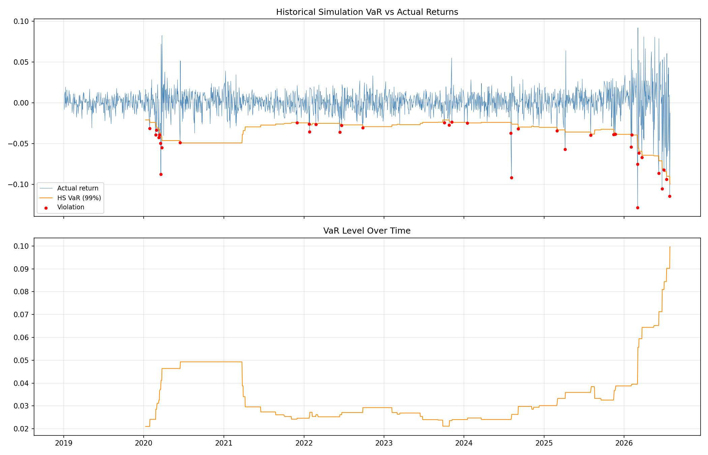

# KOSPI-VaR-Backtesting-Project
  by JAEMIN KO

2019년부터 2026년까지 KOSPI 지수를 대상으로 세 가지 VaR 모형을 구현하고,
성격이 상이한 네 차례의 시장 스트레스 국면에서 각 모형의 실패 양상을
진단하는 프로젝트.

## 진행 상황
- [x]  1.데이터 수집 및 수익률 분포 분석
- [ ]  2.Historical (v) / Parametric / Monte Carlo VaR 구현
- [ ]  3.Kupiec POF, Christoffersen, 바젤 트래픽라이트 검정
- [ ]  4.위기구간 분석 및 Expected Shortfall

## 저장소 구조

```
codes/    분석 스크립트 및 노트북
figures/  분석 결과 그래프
```

## 01. 수익률 분포 분석 결과

분석 대상: KOSPI 종합지수 (^KS11), 2019-01-03 ~ 2026-07-30, 1,857 관측치

| 항목 | 값 |
|---|---|
| 연율화 수익률 | 13.89% |
| 연율화 변동성 | 25.45% |
| 왜도 | -0.89 |
| 초과첨도 | 10.72 |
| Jarque-Bera 통계량 | 9,086.58 (p < 0.001) |

정규성 가설은 1% 유의수준에서 기각되었다. 초과첨도 10.72는 정규분포
대비 꼬리가 극단적으로 두꺼움을 의미하며, 왜도 -0.89는 손실 방향의
꼬리가 이익 방향보다 길다는 것을 나타낸다.

관측 기간 중 최대 하락일인 2026-03-04(로그수익률 -12.85%)는 정규분포
가정 하에서 -8.05σ에 해당하며, 이는 발생확률 4.1×10⁻¹⁶으로 약 9.6조 년에
한 번 관측될 사건에 해당한다. 정규분포를 가정한 Parametric VaR이 극단적
손실을 심각하게 과소평가할 수 있음을 시사한다.

주목할 점은 최대 하락일과 최대 상승일(2026-03-05, +9.19%)이 연속된
거래일이라는 것이다. 이는 극단적 수익률이 무작위로 분산되지 않고 특정
국면에 집중되는 변동성 군집 현상을 보여주며, VaR 위반의 독립성을 검정하는
Christoffersen 검정이 필요한 근거가 된다.

### 표본 기간 선택의 영향

| 표본 기간 | 관측치 | 연율화 변동성 | 왜도 | 초과첨도 |
|---|---|---|---|---|
| 2015-01 ~ 2024-12 | 2,453 | 16.80% | -0.44 | 8.42 |
| 2019-01 ~ 2026-07 | 1,857 | 25.45% | -0.89 | 10.72 |

동일 지수에 대해 표본 기간만 달리했을 때 연율화 변동성이 1.5배,
초과첨도가 27% 증가한다. 추정 기간의 선택이 리스크 측정 결과에 미치는
영향이 크다는 점을 보여주며, 본 프로젝트가 단일 기간의 평균적 성능이
아닌 국면별 성능 진단에 초점을 맞추는 이유이기도 하다.


## 02. Historical Simulation VaR

추정 윈도우 250일, 신뢰수준 99%, 판정 가능일 1,607일

| 항목 | 값 |
|---|---|
| 실제 위반 | 39회 |
| 기대 위반 | 16.1회 |
| 위반율 | 2.43% |
| 평균 VaR | 3.41% |
| 최저 VaR | 2.10% (2020-01-09) |
| 최고 VaR | 9.96% (2026-07-29) |

99% 신뢰수준에서 기대되는 위반의 2.4배가 발생하여, 모형이 실제 손실
위험을 체계적으로 과소평가하고 있음이 확인된다. Kupiec POF 검정 기준
LR 통계량은 23.63(p ≈ 1.2×10⁻⁶)으로 정확 커버리지 가설은 기각된다.

위반의 시간적 분포는 더 중요한 문제를 시사한다. 전체 39회 중 51%가
2020년(9회)과 2026년(11회, 7개월분)에 집중되어 있으며, 이는 위반이
독립적으로 발생한다는 VaR 모형의 암묵적 가정과 배치된다. 위반 빈도뿐
아니라 독립성을 함께 검정해야 할 근거이며, 후속 단계에서 Christoffersen
검정으로 확인한다.

| 연도 | 위반 횟수 |
|---|---|
| 2020 | 9 |
| 2021 | 1 |
| 2022 | 6 |
| 2023 | 3 |
| 2024 | 4 |
| 2025 | 5 |
| 2026 | 11 (7개월분) |

추정 윈도우 내 최저 VaR이 2020-01-09(2.10%)에 관측된 점은 Historical
Simulation의 구조적 한계를 드러낸다. 과거 250일의 경험적 분포에만
의존하므로 안정기 직후의 충격에 대응하지 못하며, 반대로 최고 VaR은
급락이 이미 발생한 2026-07-29(9.96%)에 나타나 사후적 과잉 반응을 보인다.
관측 기간 중 VaR 수준은 최저 대비 최고가 4.7배에 달했다.



## 데이터

KRX 정보데이터시스템의 회원제 전환으로 pykrx 사용이 제한되어
Yahoo Finance API로 전환. 수정종가 기준 일별 데이터.

## 실행

```
pip install -r requirements.txt
python codes/01_log_return_distribution.py
python codes/02_Historical_VaR.py
```
